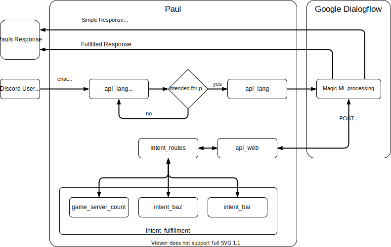

# This is Paul.

---
## Overview
This repo contains everything that makes Paul, Paul!

## TODO
Here is what we still need to do to make Paul a real boy.

- Add security context settings to force the container to run as a non-root user/group and drop all capabilities.
- Implement the interfaces Paul will use to find and query his game servers.
- Teach Paul how to talk and help Paul understand how we're going to talk to him.
- Understand the scope of the second and third item so they can be broken down into actionable subtasks

## This is how we interact with Paul
